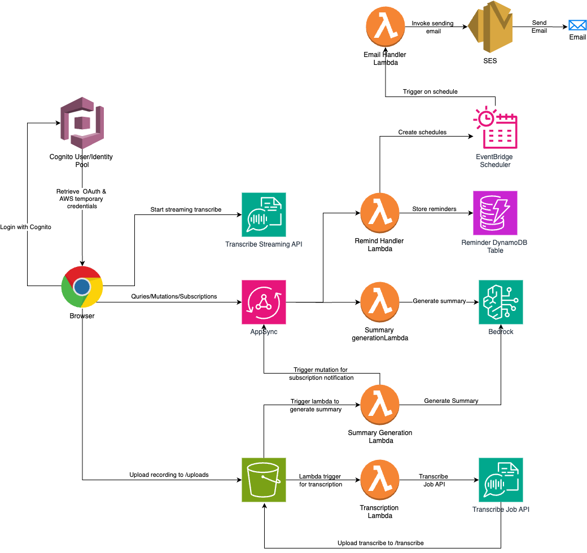

# CuddleScribe - Your Child Health & Development Companion

CuddleScribe is a comprehensive web application designed to help parents track and manage their children's health and development journey. The application provides features for recording medical consultations, tracking developmental milestones, setting reminders, and generating AI-powered summaries of health conversations.


- **Live Demo**: https://d3j9l9t024859x.cloudfront.net/

## 🌟 Features

- **Medical Consultation Recording & Transcription**
  - Record doctor visits in real-time
  - Upload pre-recorded consultations
  - Automatic transcription using AWS Transcribe
  - AI-powered summaries of medical conversations

- **Development Milestone Tracking**
  - Access expert information about child development from 1 to 60 months
  - Track and monitor your child's growth progress
  - Receive age-appropriate developmental guidelines

- **Smart Reminders**
  - Set reminders for medications and follow-ups
  - Track important milestone dates
  - Never miss critical appointments or medications

## 🚀 Getting Started

### Prerequisites

- Node.js (v18 or higher)
- AWS Account with appropriate permissions
- AWS CLI configured with your credentials
- SAM CLI

### Installation

1. Clone the repository

2. Install dependencies:
```bash
npm install
```

3. Setup your AWS Credentials

4. Deploy the infrastructure:
```bash
sam build
sam deploy
```

4. Update the configurations in `src/configs.ts`
   - COGNITO_POOL_ID: The Cognito Pool ID created after SAM deployment
   - COGNITO_IDENTITY_POOL_ID: The Cognito Identity Pool ID crated after SAM deploy
   - REGION: AWS region
   - COGNITO_CLIENT_ID: Cognito Pool App Client ID
   - COGNITO_DOMAIN: Cognito Domain
   - COGNITO_REDIRECT_URI: Cognito login URL. For localhost use `http://localhost:3000`
   - COGNITO_LOGOUT_URI = Cognito logout URL. For localhost, use `http://localhost:3000`
   - BACKEND_API_URL: Appsync Backend URL. This can be obtained by after deploying the backend project (`https://github.com/sidathasiri/medical-convo-summarizer`)


4. Start the development server:
```bash
npm start
```

### Production Deployment

1. Follow the Installation instructions
2. Run `npm run deploy` to deploy the web application to CloudFront
3. Update the login/logout URLs with the CloudFront generated URL in `src/configs.ts`
4. Re-run the `npm run deploy` command

## 🏗️ Architecture

The application uses a modern, scalable architecture:



- **Frontend**
  - React with TypeScript
  - AWS Amplify for authentication
  - Real-time websocket connections for transcription

- **Backend Services**
  - AWS Cognito for authentication and user management
  - AWS S3 for static website hosting and file storage
  - AWS CloudFront for content delivery
  - AWS Transcribe for real-time speech-to-text
  - AWS AppSync for GraphQL API

## 📁 Project Structure

```
src/
├── components/         # Reusable UI components
├── pages/              # Page components and layouts
│   ├── HomePage/       # Main application interface
│   └── LandingPage/    # Public landing page
├── services/           # AWS service integrations
├── hooks/              # Custom React hooks
├── graphql/            # GraphQL queries and mutations
└── configs.ts         # AWS configuration
```

## 🛠️ Development

### Available Scripts

- `npm start`: Start development server
  - Runs the app in development mode
  - Open [http://localhost:3000](http://localhost:3000) to view it
  - Page reloads on edits
  - Shows lint errors in console
- `npm run build`: Build for production
  - Builds the app for production to `build` folder
  - Optimizes build for best performance
  - Minifies and hashes filenames

### AWS Infrastructure

The application is deployed using AWS SAM (Serverless Application Model):

- `template.yaml` defines the infrastructure:
  - S3 bucket for static website hosting
  - CloudFront distribution for content delivery
  - Cognito User Pool for authentication
  - IAM roles and policies
  - CloudFront Functions for SPA routing

### Contributing

1. Fork the repository
2. Create a feature branch
3. Commit your changes
4. Push to the branch
5. Open a Pull Request

Please make sure to:
- Follow the existing code style
- Add tests for new features
- Update documentation as needed

## 📞 Support

For support:
- Open an issue in the GitHub repository
- Check existing issues for answers
- Contact the maintainers
